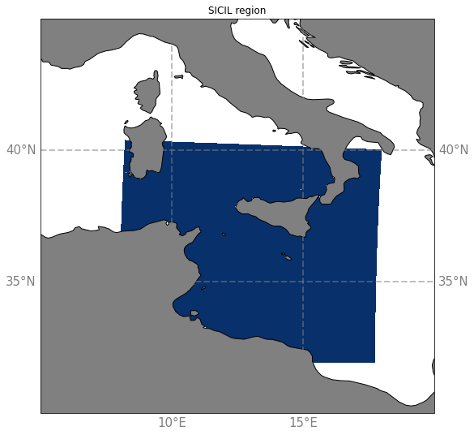

# Description of SICIL extractions

This repository describes the SICIL extractions of the [eNATL60](https://github.com/ocean-next/eNATL60) twin simulations : how to get it and how to reproduce it.

The SICIL region corresponds to the blue area on this map :

The 3D temperature, salinity and velocities data have been extracted from raw simulation outputs with NCO commands gathered in the [slice](https://github.com/aureliealbertmeom/slice) package, the indices delimiting the SICIL region in the North Atlantic domain are : from 6352 to 6935 along i-axis and from 1656 to 2311 along j-axis. The periods of extraction are 2009, July to September and 2010, January to March.

You can access the files directly at :
  - [this link](https://ige-meom-opendap.univ-grenoble-alpes.fr/thredds/catalog/meomopendap/extract/MEOM/eNATL60/eNATL60-BLBT02/1h/SICIL/catalog.html) for eNATL60-BLBT02 (the simulation with tides)
  - [this link](https://ige-meom-opendap.univ-grenoble-alpes.fr/thredds/catalog/meomopendap/extract/MEOM/eNATL60/eNATL60-BLB002/1h/SICIL/catalog.html) for eNATL60-BLB002 (the simulation without tides)

Or you can use [this script](scripts/download-SICIL.ksh) to download them.

All the informations needed to reproduce the whole North Atlantic simulations are available here : https://github.com/ocean-next/eNATL60/blob/master/02_experiment-setup.md

